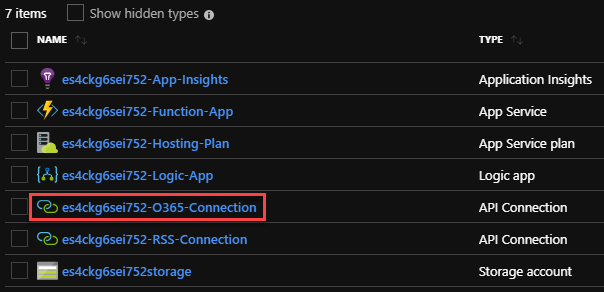

# Office 365 Update Notification (v0.2)

**Time to deploy**: 2 minutes

The **Office 365 Update Notification** template provisions an Azure Logic app that notifies the specified Office 365 email address when updates are published to the [Office 365 Endpoints RSS feed](https://endpoints.office.com/version/worldwide?clientRequestId=b10c5ed1-bad1-445f-b386-b919946339a7&allVersions=true&format=RSS), and an App Service Function app that converts the JSON output of endpoint updates to human-readable tables.

**NOTE**: You must specify an Office 365 email account for the solution to work without modification.

## Usage

Deploying the solution is very simple, and no further configuration is required. However, you must authenticate with your Office 365 account before the solution can send emails to the email address you specified.

1. Click the **Deploy to Azure** button to open the deployment UI in the Azure portal. Deployment should only take a couple of minutes.

2. Navigate to the resource group, and click on the API Connection object named **<_unique_prefix_>-O365-Connection**.

    

3. In the API Connection blade, click **This connection is not authenticated**.

    

4. In the Edit blade, click **Authorize**.

    

5. You should see the message _"Authorization was successful"_, and the **Authorize** button will be greyed out. Click **Save** to save your authorization token for future use.

    

The authorization should be good for one year, at which point you will need to return to the O365 API Connection object and reauthorize the connection.

### Testing the solution

The Logic app is only triggered when a new RSS article is published, and this only occurs one or two times a month so it's important to be able to have some means to test the solution. You can use the test procedure in [Step 5 – Testing and troubleshooting the flow](https://github.com/pandrew1/Office365-IPURL-Samples/tree/master/FlowNotifications#step-5--testing-and-troubleshooting-the-flow) in the [manual deployment guide](https://github.com/pandrew1/Office365-IPURL-Samples/tree/master/FlowNotifications) as a guide, substituting references to _Microsoft Flow_ with the **Logic app** in your solution. Microsoft Flow is built on the Azure Logic app feature, so the process is very similar.

## Solution overview and deployed resources

The following resources are deployed as part of the solution:

+ **Logic app**: Triggered by the Office 365 Endpoints RSS feed, the Logic App contains the workflow that notifies your specified email address when updates to the Office 365 endpoints are published.
+ **App Service**: The App Service Function app converts the JSON output of endpoint updates to human-readable tables and add them to the email notification.
+ **App Service Plan**: Web services to support the App Service.
+ **App Insights**: Provides monitoring and logging for solution components.
+ **API Connections**: Connects the solution to an Office 365 email account and the RSS feed.
+ **Storage account**: Storage for log files and usage/dignostics data.

## Solution notes

+ You can modify the Logic app with additional functionality, such as adding an approval process or additional outputs targeted for your organization's particular workflow for updating Office 365 endpoints.
+ You can use a non-Office 365 email address by modifying the Logic app post-deployment with a standard email action instead of the Office 365 Email action.
+ See [Creating a Microsoft Flow to email yourself when an Office 365 IP/URL change occurs](https://github.com/pandrew1/Office365-IPURL-Samples/tree/master/FlowNotifications) for additional solution details and procedures for manually building the solution.

## Known issues

## See also

+ [Office 365 IP Address and URL Web service](https://aka.ms/ipurlws)
+ [Creating a Microsoft Flow to email yourself when an Office 365 IP/URL change occurs](https://github.com/pandrew1/Office365-IPURL-Samples/tree/master/FlowNotifications)

`Tags: Office 365 endpoints`
___
Developed by the **MAX Skunkworks Lab**  
Authors:

+ Kelley Vice (kvice@microsoft.com)
+ Paul Andrew (pandrew@microsoft.com)

https://github.com/maxskunkworks

Last update: _4/17/2019_

## Changelog

+ **4/16/2019**: Original commit
+ **4/17/2019**: Updated function build zip file, updated function resource